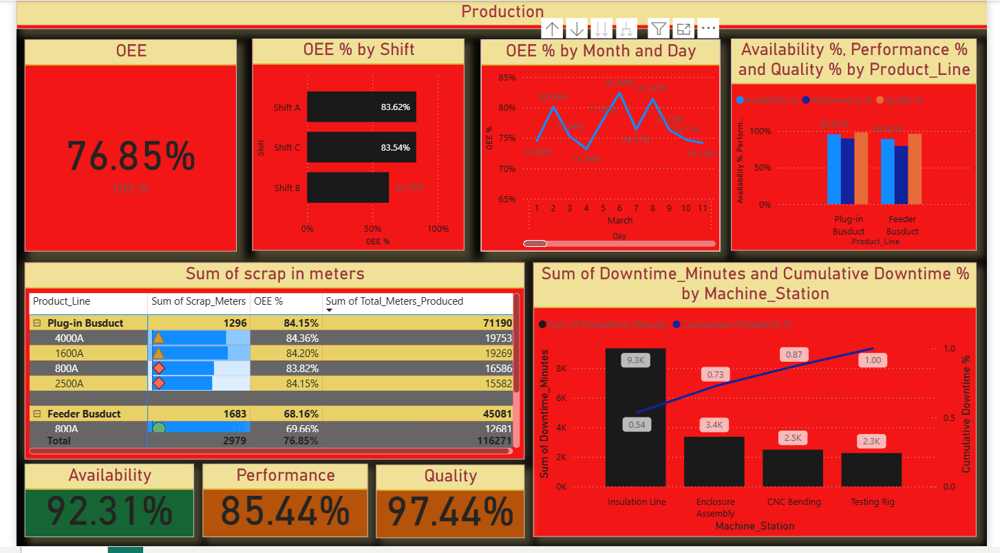
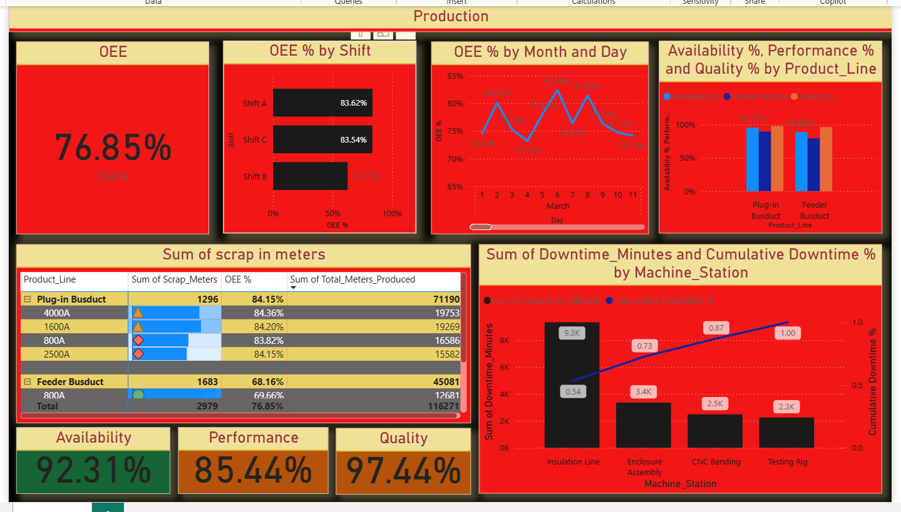

# Busduct Manufacturing OEE Analytics Dashboard

## Project Overview
An interactive Power BI MIS dashboard optimizing Overall Equipment 
Effectiveness (OEE) and root-cause downtime analysis for an electrical 
busduct manufacturing plant.

## Tech Stack
`Python` `Pandas` `NumPy` `Power BI` `DAX` `Power Query (M Code)`

## Key Features
- 90-day simulated shop-floor dataset (1,000+ rows) generated using Python
- Composite key (Date_Shift_Key) for cross-filtering across many-to-many schemas
- DAX measures for OEE pillars: Availability, Performance, Quality
- Conditional formatting alerts isolating Shift B efficiency drop (20% loss)
- Root-cause traced to insulation calibration defects on coating lines

## Dashboard Screenshots

### OEE Overview

### Shift-wise Analysis

### Downtime Root Cause

## Results
- Identified 20% operational efficiency drop on Shift B
- Root cause: insulation calibration defects on coating lines
- Enabled data-driven maintenance scheduling decisions
